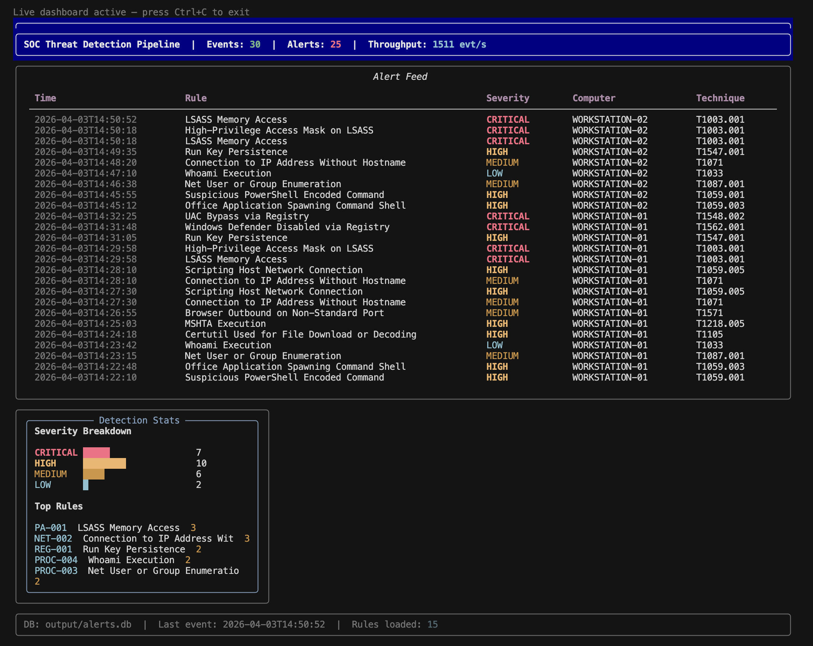
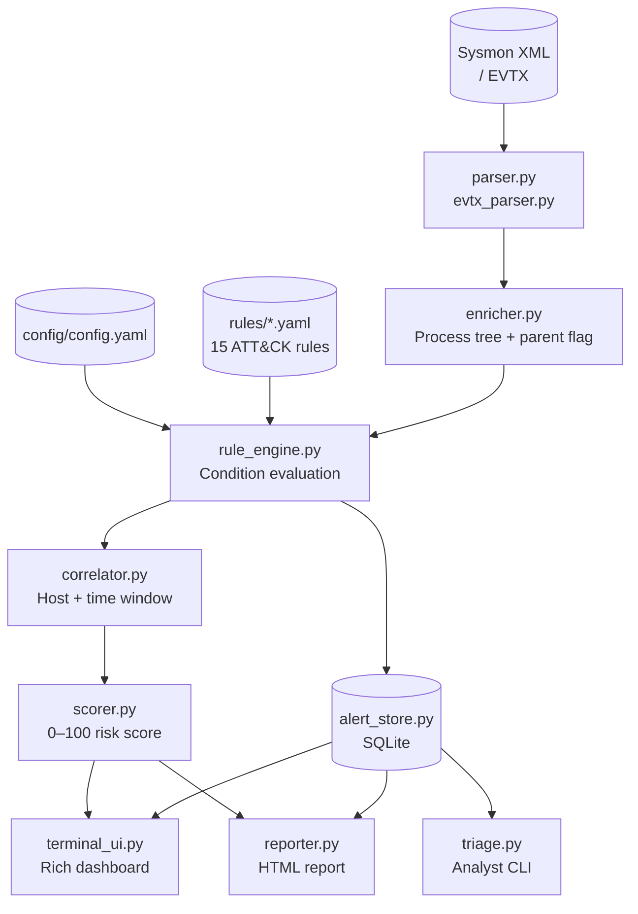
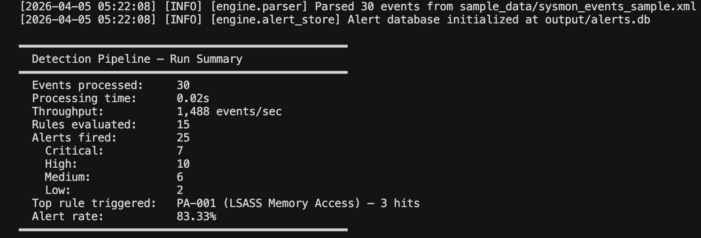
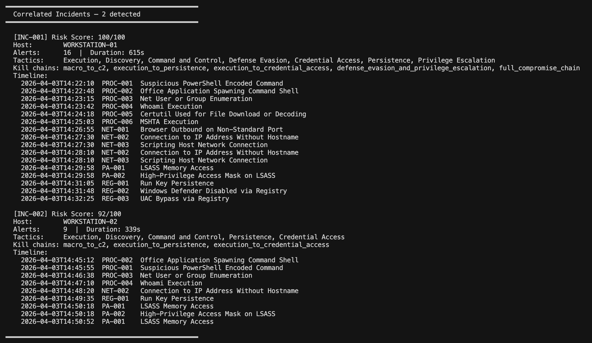
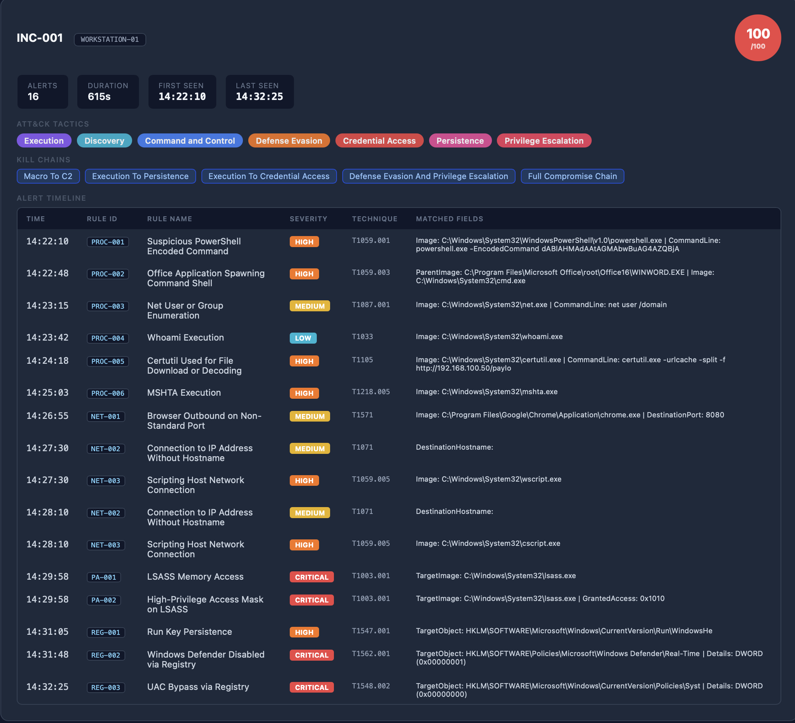
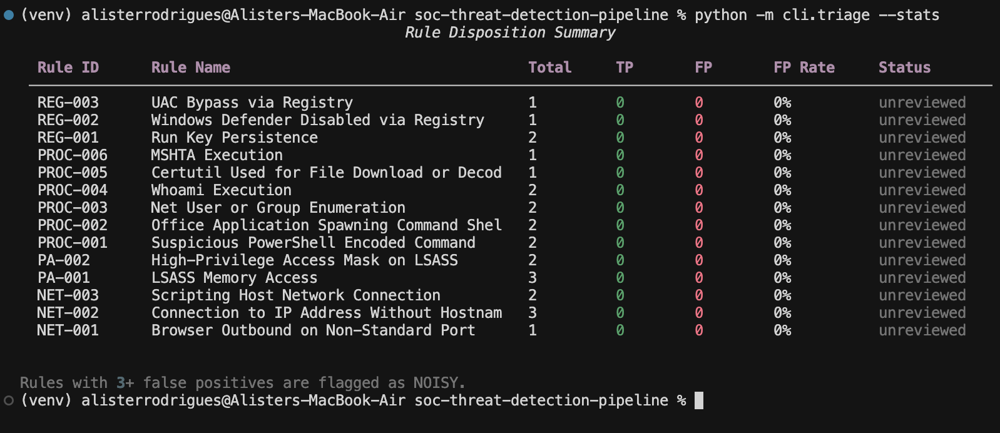

# SOC Threat Detection Pipeline

[](https://github.com/alisterrodrigues/soc-threat-detection-pipeline/actions/workflows/ci.yml)


A Python-based behavioral threat detection engine for Windows Sysmon logs. It ingests raw endpoint telemetry, evaluates events against MITRE ATT&CK-mapped detection rules, correlates alerts into scored incidents, and surfaces results through a terminal dashboard, analyst triage CLI, and self-contained HTML report — the complete analyst workflow from raw log to dispositioned incident, running entirely offline.

---



---

## Why this project

Most detection projects stop at "match a string, print an alert." This one models the full SOC workflow:

- **Detection** — 15 behavioral rules across process creation, network connections, registry modifications, and process access events, each mapped to a specific MITRE ATT&CK technique with documented false positive guidance
- **Correlation** — alerts on the same host within a configurable time window are grouped into incidents, annotated with kill chain coverage, and risk-scored 0–100
- **Analyst workflow** — alerts persist to SQLite with disposition support; the triage CLI lets analysts mark true/false positives and track per-rule FP rates over time
- **Reporting** — a self-contained HTML report summarizes incidents, matched fields, and ATT&CK coverage without requiring any external tools to open

The sample dataset ships with two hosts and two distinct attack scenarios — a Word macro dropper chain and an Excel macro persistence chain — so the correlator produces two separate incidents with different risk profiles out of the box.

---

## Architecture



---

## Quick start

**Requirements:** Python 3.11+

```bash
git clone https://github.com/alisterrodrigues/soc-threat-detection-pipeline.git
cd soc-threat-detection-pipeline
python -m venv venv && source venv/bin/activate
pip install -r requirements.txt

# Run against the included sample data
python -m cli.main --input sample_data/sysmon_events_sample.xml --benchmark

# Run tests
pip install -r requirements-dev.txt
pytest tests/ -v
```

The sample dataset contains 30 Sysmon events across two hosts and two attack scenarios. A clean run produces 25 alerts across both hosts, which the correlator groups into two distinct incidents.

---

## CLI reference

### Main pipeline — `python -m cli.main`

| Flag | Description |
|------|-------------|
| `--input FILE` | Path to Sysmon XML or EVTX log file **(required)** |
| `--evtx` | Treat `--input` as a `.evtx` file — requires `pip install python-evtx` |
| `--config FILE` | Path to config.yaml `[default: config/config.yaml]` |
| `--output-dir DIR` | Directory for output files `[default: output/]` |
| `--severity LEVEL` | Minimum severity to store: `low\|medium\|high\|critical` |
| `--benchmark` | Print throughput and alert summary at completion |
| `--export FORMAT` | Export alerts after processing: `json\|csv\|both` |
| `--report` | Generate a self-contained `output/incident_report.html` |
| `--no-dashboard` | Headless mode — stream alert JSON to stdout |
| `--live` | Live tailing dashboard — polls the database until Ctrl+C |
| `--explain` | Print per-alert condition match breakdown |
| `--correlate` | Run correlation engine and print incident summary to stdout |
| `--hunt TERMS` | Comma-separated keyword search across all alert fields |

### Analyst triage — `python -m cli.triage`

| Flag | Description |
|------|-------------|
| `--db PATH` | Path to alerts database `[default: output/alerts.db]` |
| `--rule RULE_ID` | Filter to a specific rule ID (e.g. `PROC-001`) |
| `--severity LEVEL` | Minimum severity filter: `low\|medium\|high\|critical` — shows alerts at this level and above |
| `--undispositioned` | Show only alerts not yet reviewed |
| `--stats` | Print per-rule TP/FP summary table and exit |

### Sigma converter — `python tools/sigma_converter.py`

| Flag | Description |
|------|-------------|
| `--input PATH` | Sigma `.yml` file or directory of rules **(required)** |
| `--output PATH` | Output file or directory — prints to stdout if omitted |
| `--verbose` | Show all conversion warnings |

---

## Detection rules

15 rules across four Sysmon event categories. Each maps to a specific ATT&CK technique, documents known false positive sources, and includes a `tuning_tag` for future allowlist integration.

| Rule ID | Name | Event | Technique | Tactic | Severity |
|---------|------|:-----:|-----------|--------|:--------:|
| PROC-001 | Suspicious PowerShell Encoded Command | 1 | T1059.001 | Execution | High |
| PROC-002 | Office Application Spawning Command Shell | 1 | T1059.003 | Execution | High |
| PROC-003 | Net User or Group Enumeration | 1 | T1087.001 | Discovery | Medium |
| PROC-004 | Whoami Execution | 1 | T1033 | Discovery | Low |
| PROC-005 | Certutil Used for File Download or Decoding | 1 | T1105 | Command and Control | High |
| PROC-006 | MSHTA Execution | 1 | T1218.005 | Defense Evasion | High |
| NET-001 | Browser Outbound on Non-Standard Port | 3 | T1571 | Command and Control | Medium |
| NET-002 | Connection to IP Address Without Hostname | 3 | T1071 | Command and Control | Medium |
| NET-003 | Scripting Host Network Connection | 3 | T1059.005 | Execution | High |
| REG-001 | Run Key Persistence | 13 | T1547.001 | Persistence | High |
| REG-002 | Windows Defender Disabled via Registry | 13 | T1562.001 | Defense Evasion | Critical |
| REG-003 | UAC Bypass via Registry | 13 | T1548.002 | Privilege Escalation | Critical |
| PA-001 | LSASS Memory Access | 10 | T1003.001 | Credential Access | Critical |
| PA-002 | High-Privilege Access Mask on LSASS | 10 | T1003.001 | Credential Access | Critical |
| PA-003 | Non-System Binary Accessing Sensitive Process | 10 | T1055 | Defense Evasion | High |

Rules live in `rules/` as plain YAML. The engine discovers all `*.yaml` files at startup — no code changes are needed to add or modify detections. See [`docs/rule_authoring_guide.md`](docs/rule_authoring_guide.md) for the full rule schema and operator reference.

---

## Screenshots

**Benchmark summary**



**Correlated incident output**



**HTML incident report**



**Analyst triage stats**



---

## Benchmark

Sample run against the 30-event dataset (two hosts, two attack scenarios):

```
━━━━━━━━━━━━━━━━━━━━━━━━━━━━━━━━━━━━━━━━━━━━━━━━━━
  Detection Pipeline — Run Summary
━━━━━━━━━━━━━━━━━━━━━━━━━━━━━━━━━━━━━━━━━━━━━━━━━━
  Events processed:     30
  Processing time:      0.02s
  Throughput:           ~1,450 events/sec
  Rules evaluated:      15
  Alerts fired:         25
    Critical:           7
    High:               10
    Medium:             6
    Low:                2
  Top rule triggered:   PA-001 (LSASS Memory Access) — 3 hits
  Alert rate:           83.33%
━━━━━━━━━━━━━━━━━━━━━━━━━━━━━━━━━━━━━━━━━━━━━━━━━━
```

The 25 alerts correlate into two incidents with distinct risk profiles. INC-001 (WORKSTATION-01, score 100/100) covers all seven ATT&CK tactics across 16 alerts spanning 615 seconds — Execution through Privilege Escalation — and matches all five kill chain patterns including `full_compromise_chain`. INC-002 (WORKSTATION-02, score 92/100) covers five tactics across 9 alerts in 339 seconds, representing a lower-stage Excel macro intrusion that progresses from Execution to Credential Access but lacks the defense evasion and privilege escalation steps of the first scenario.

---

## Test coverage

54 tests across all engine components:

| Module | What is tested |
|--------|---------------|
| `engine/parser.py` | XML normalization, missing files, malformed XML, EventData extraction |
| `engine/rule_engine.py` | All 7 operators, AND/OR logic, empty-condition guard, rule loading |
| `engine/alert_store.py` | Store, retrieve, severity filtering, disposition marking, stats |
| `engine/correlator.py` | Host grouping, time window boundaries, kill chain detection, multi-host separation, sequential ID numbering |
| `engine/scorer.py` | Score bounds, severity/tactic/chain/volume caps, sort order |
| `engine/reporter.py` | File creation, HTML validity, self-containment, custom title |
| `engine/evtx_parser.py` | Record parsing, malformed XML, missing file, graceful degradation |

```bash
pip install -r requirements-dev.txt
pytest tests/ -v
```

---

## Writing detection rules

```yaml
rules:
  - id: "PROC-001"
    name: "Suspicious PowerShell Encoded Command"
    description: "Detects PowerShell launched with -EncodedCommand"
    severity: high                    # low | medium | high | critical
    mitre_technique: "T1059.001"
    mitre_tactic: "Execution"
    event_id: 1                       # Sysmon Event ID
    conditions:
      - field: "Image"
        operator: contains            # contains | not_contains | equals | not_equals
        value: "powershell.exe"       # startswith | endswith | regex
        case_insensitive: true
      - field: "CommandLine"
        operator: contains
        value: "-EncodedCommand"
        case_insensitive: true
    logic: AND                        # AND | OR across all conditions
    false_positive_notes: "Verify parent process and context."
    tuning_tag: "powershell_encoded"
```

Drop any new `.yaml` file into `rules/` and it loads on the next run. Full operator reference: [`docs/rule_authoring_guide.md`](docs/rule_authoring_guide.md).

---

## Sigma rule import

`tools/sigma_converter.py` translates Sigma detection rules to the pipeline's native YAML format.

```bash
# Convert a single rule and print to stdout
python tools/sigma_converter.py --input sigma_rule.yml

# Write output to the rules directory
python tools/sigma_converter.py --input sigma_rule.yml --output rules/converted.yaml

# Batch convert a directory
python tools/sigma_converter.py --input sigma_rules/ --output rules/ --verbose
```

The converter handles `logsource` category-to-event-ID mapping, `|contains`, `|startswith`, `|endswith`, and `|re` modifiers, and ATT&CK tag extraction. Unsupported constructs (`selection and not filter`, `1 of selection*`, multi-selection patterns) emit warnings rather than silently producing incorrect output. Converted rules should be reviewed before use, particularly for rules that rely on exclusion logic.

---

## Docker

```bash
# Build
docker build -t soc-pipeline .

# Run against a log file
docker run --rm \
  -v /path/to/logs:/data \
  -v $(pwd)/output:/app/output \
  soc-pipeline --input /data/sysmon.xml --no-dashboard --benchmark

# Generate HTML report
docker run --rm \
  -v /path/to/logs:/data \
  -v $(pwd)/output:/app/output \
  soc-pipeline --input /data/sysmon.xml --no-dashboard --report
```

---

## Design decisions and known limitations

Full rationale for scoring weights, correlation algorithm, and detection philosophy: [`docs/detection_engineering_notes.md`](docs/detection_engineering_notes.md).

**Correlation model** — incidents are formed using adjacency chaining: each new alert on the same host is compared to the timestamp of the previous alert, not the start of the incident. Alerts spaced further apart than `time_window_seconds` start a new group. Bounded-window correlation (comparing each alert to the group's first timestamp) is a natural extension documented in the engineering notes.

**Sigma converter** — handles the most common constructs used in Windows/Sysmon Sigma rules. Exclusion patterns and wildcard multi-selection (`1 of selection*`, `all of selection*`) are not fully implemented and require manual completion after conversion.

**PA-001 and PA-003** — these are broad heuristic hunting rules, not high-confidence escalation triggers. PA-002 (access mask matching) is the high-confidence LSASS detection. False positive sources are documented in each rule's `false_positive_notes` field.

**Scale** — the engine processes log files in full-document mode. For very large exports (100k+ events), streaming XML parsing and batched SQLite inserts would improve throughput.

---

## Repository structure

```
soc-threat-detection-pipeline/
├── cli/
│   ├── main.py              # Pipeline entry point — all CLI flags
│   └── triage.py            # Interactive analyst triage CLI
├── config/
│   └── config.yaml          # All tunable parameters
├── dashboard/
│   └── terminal_ui.py       # Rich terminal dashboard — one-shot and live modes
├── docs/
│   ├── architecture.md                 # Module map and full data flow
│   ├── detection_engineering_notes.md  # Scoring rationale and design decisions
│   ├── rule_authoring_guide.md         # Rule schema and operator reference
│   └── screenshots/                    # README images
├── engine/
│   ├── alert_store.py       # SQLite backend with analyst disposition support
│   ├── correlator.py        # Alert grouping by host and time window
│   ├── enricher.py          # Process tree ancestry + suspicious parent detection
│   ├── evtx_parser.py       # Direct .evtx ingestion via python-evtx
│   ├── parser.py            # Sysmon XML → normalized event dicts
│   ├── reporter.py          # Self-contained HTML incident report generator
│   ├── rule_engine.py       # YAML rule loader and condition evaluator
│   └── scorer.py            # 0–100 incident risk scoring
├── output/                  # Generated files — gitignored
├── rules/
│   ├── network_connection.yaml
│   ├── process_access.yaml
│   ├── process_creation.yaml
│   ├── registry_modification.yaml
│   └── README.md
├── sample_data/
│   ├── sysmon_events_sample.xml   # 30-event dataset — two hosts, two attack scenarios
│   └── expected_alerts.json       # Expected alert IDs for regression reference
├── tests/                   # 54 tests across all engine components
├── tools/
│   └── sigma_converter.py   # Sigma → native YAML rule translator
├── Dockerfile
├── pyproject.toml
├── requirements.txt         # Runtime dependencies
└── requirements-dev.txt     # Development dependencies
```

---

## License

MIT — see [LICENSE](LICENSE).
